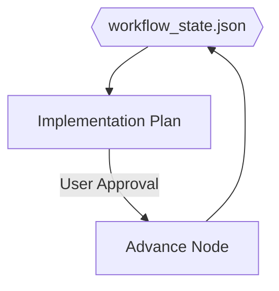

# Content Workflow Skill

This skill defines the operational methodology for the **Content Research & Draft** project. It enforces a "Fake RAG" model where context is infused from a local library and validated via a Human-in-the-Loop (HitL) process using **Antigravity Implementation Plans**.

## Core Components
- **State management**: `directives/workflow_state.json` (The heart of the graph).
- **Context Library**: `directives/context_library/` (Brand guides, SOPs, Fact sheets).
- **Project Prompts**: `directives/prompts/` (Node-specific instructions).

## Operating Principle: Node-by-IP
To prevent chat context saturation and ensure high-fidelity reviews, every workflow node is executed within an **Antigravity Implementation Plan (IP)**.

| Node | Action | Primary Output |
|---|---|---|
| **Node 0** | Context Discovery | Refined JSON context in IP review |
| **Node 1** | Outline Generation | Markdown Outline in IP review |
| **Node 2** | CoVe Drafting | Complete Draft in IP review |
| **Node 3** | QA & Export | Grading Table & HTML in IP review |

## Workflow Diagram

## Prompting Rules
- Always reference the absolute path to `directives/context_library/` items.
- Always include a "Verification Check" against `workflow_state.json`.
- When in an IP, the "Proposed Changes" section should contain the primary artifact for that node (e.g., the Outline).

## Model Selection & Verification
- **Rule**: Before starting any node, the assistant must verify the active model (e.g., **Gemini 1.5 Pro** for Research/QA, **Claude 3.5** for Creative Drafting).
- **Reminder**: Always ask the user to confirm the model in the chat or IP before execution if a switch is required for optimal performance.
