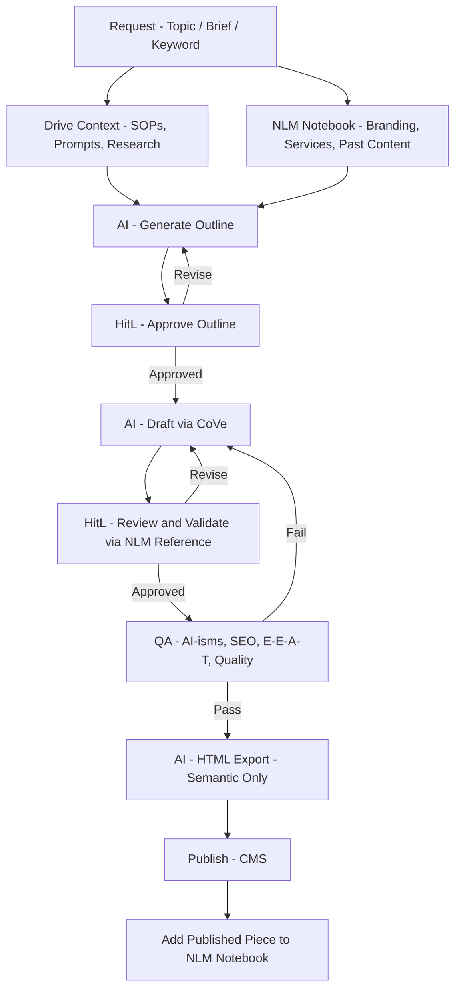

# Content Pipeline: Human-First Proof of Concept

## Goal
Build a structured, Google Drive-based content workflow that any AI chatbot (Gemini, ChatGPT, Claude) can plug into via Drive access. Humans manage and approve — automation comes later once the process is proven.

---

## Workflow



---

## Folder Structure

### Agency Level (Shared, One-Time Setup)
```
00_AGENCY/
├── prompts/        Master prompt templates
├── lsi-library/    Per-service contextual term lists (built from Ahrefs, reused per client)
└── docs/           SOPs, brand voice guides, standards
```

### Per-Client (Replicated for Each Client)
```
[Client Name]/
├── prompts/           Client-specific prompt variants (if needed)
├── docs/              Service descriptions
└── active-work/
    └── [Order Name]/  One folder per order
        └── [Page].doc One doc per page (draft + final = same doc)
```

> **Rule:** Same structure, every client.
> **Outlines:** In-chat only — not saved.
> **Drafts:** One document per page, start to finish. Version history handles rollback.

---

## Context Injection

**Drive — attached per session via connector:**

| Doc Type | Notes |
|---|---|
| SOPs | Agency-level operating procedures |
| Prompts | Template for the current content type |
| Research | Page-specific SERP notes and sources |
| LSI / Contextual Term List | From POP or equivalent tool — required for every page |

**NLM — human reference during HitL review (3 inputs per client):**

| Source | Purpose |
|---|---|
| Branding guide | Validate tone, voice, style |
| Service descriptions | Fact-check service accuracy |
| Past published content | Spot duplicate topics, check consistency |

> **NLM Role:** Reference tool for human editors only — not an AI input. Editor queries NLM during HitL review using targeted prompts to validate the draft. New completed pieces are added manually post-publish (automated via Apps Script in Phase 2).

---

## Stage Breakdown

| Stage | Who | What |
|---|---|---|
| **Research** | Human | Drop SERP notes and sources into order folder |
| **Outline** | AI + HitL | AI generates outline from Drive context + NLM inputs (branding, services, past content); human approves in chat — not saved |
| **Draft (CoVe)** | AI + HitL | AI drafts via Chain-of-Verification using same context; human reviews and validates draft against NLM |
| **Final QA** | AI | Remove AI-isms, grade SEO, check E-E-A-T, flag quality issues |
| **Competitive Calibration** | AI + HitL | TBD — post-QA comparison against top ranking pages to identify term/entity gaps; surgical additions only |
| **HTML Export** | AI | Strict semantic HTML — no classes, no inline styles |
| **Publish** | Human | Clean HTML into CMS |
| **Add to NLM** | Human | Add published piece to client NLM notebook while context is fresh |

---

## Tooling Notes

| Tool | Phase | Purpose |
|---|---|---|
| **Google Drive** | Now | Master storage — all docs live here |
| **Claude / Gemini (chat)** | Now | Drafting, QA, and HTML export via prompt |
| **NotebookLM** | Phase 2 | Per-client reference notebook — 3 inputs: branding, services, past content |
| **Apps Script** | Phase 2 | Auto-add new completed pages to NLM (replaces manual post-publish step) |
| **Agentic Workflow** | Phase 3 | Full pipeline automation |

---

## Open Questions
1. **Who's the human operator?** Just you, or a team?
2. **What content types?** Blog posts, social, both, other?
3. **Is there a tracking layer?** Google Sheet as content calendar/status tracker?
