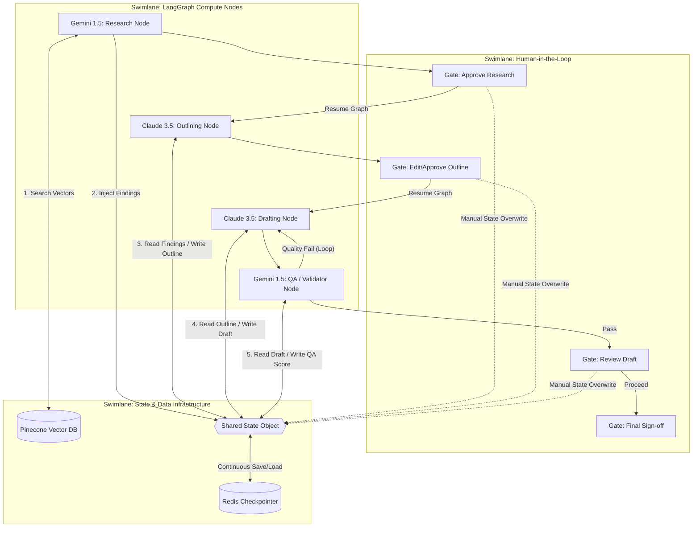

# PROJECT CONTEXT: Content Research & Draft

## High-Level Architecture
- Anti-Gravity 3-Layer Framework
- Focus: Researching and drafting content using automated pipelines.

## Tech Stack
- [Frameworks/Tools identified in project]

## Persistent State & Status
- **Current Goal**: Setting up standardized project structure and directives.
- **Status**: Active development.
- **Verified Scopes**: N/A

## Machine Setup
When cloning this project on a new device, run the following to restore external asset access:
- **Run Setup Script**: `powershell execution/setup_workspace.ps1`
- **Goal**: Reconstructs `.lnk` pointers to local Google Drive paths and verifies agent configuration.

## Standard Patterns
- Modular directive/execution separation.
